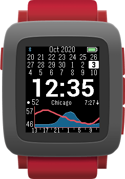
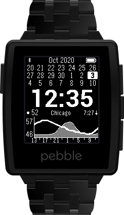

[](https://github.com/mattrossman/forecaswatch2/releases/latest)
[](https://github.com/mattrossman/forecaswatch2/releases/latest/download/forecaswatch2.pbw)
[](https://developer.rebble.io/developer.pebble.com/guides/tools-and-resources/hardware-information/index.html)
[](https://travis-ci.org/mattrossman/forecaswatch2)
[](https://www.gnu.org/licenses/gpl-3.0)
[](https://paypal.me/mttrssmn)


Once upon a time I relied on *ForecasWatch* as the daily driver watchface on my beloved red Pebble Time. Recently, the free tier of the Weather Underground API on which the watchface relied was discontinued, making a huge portion of the watchface unusable.

The developer, RCY, is nowhere to be found in the Rebble era. I plan to continue using my Pebble(s) for years to come, so this is my attempt to revive this wonderful watchface—and this time it's open source!

## Screenshots

<div>
    
    
</div>

## Features

* Current time
* Battery indicator
* 3 week calendar
* 24 hour weather forecast (updates every 30 minutes)
* Bluetooth connection indicator
* Quiet time indicator
* Multiple weather providers (Weather Underground*, DarkSky)
* Current temperature
* Temperature forecast (red line)
* Precipitation probability forecast (blue area)
* City where forecast was fetched
* Next sunrise or sunset time
* GPS or manual location entry
* Fahrenheit and Celsius temperatures
* Customize time font and color
* Customize colors for Sundays, Saturdays, and US federal holidays
* Offline configuration page

*\* Using a hacky workaround*

## Platforms

All rectangular watches are supported (Classic, Steel, Time, Time Steel, Pebble 2).

## Installation

### Rebble

A stable release is was made available on the Rebble store thanks to @joshua. [Click here for the store page.](https://apps.rebble.io/en_US/application/5dcdca6ac393f50cf6dbc264)

### Manual install

For more cutting-edge features, download the latest [`forecaswatch2.pbw`](https://github.com/mattrossman/forecaswatch2/releases/latest/download/forecaswatch2.pbw) release. On Android you can use [Cx File Explorer](https://play.google.com/store/apps/details?id=com.cxinventor.file.explorer) to open this file through the Pebble app.

## Developers

### Building

Prerequisites: [Node.js](https://nodejs.org/en/) and [Docker Desktop](https://docs.docker.com/get-docker/)

```bash
# Install JS dependencies
npm install

# Start the detached docker container
npm start

# Build within the container
npm run build
```

This will build the project inside a docker container containing the Pebble SDK. The `.pbw` output can be found in the `build` directory on the host machine.

You can also use `npm run shell` to access other Pebble CLI commands.

### Config
You can create a file `src/pkjs/dev-config.js` to set values for Clay keys (for convenience), e.g.

```javascript
var darkSkyApiKey = 'abc123';
module.exports.darkSkyApiKey = darkSkyApiKey;
```
