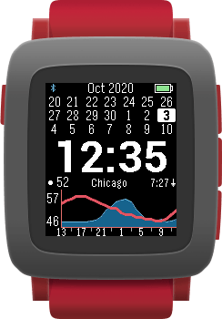
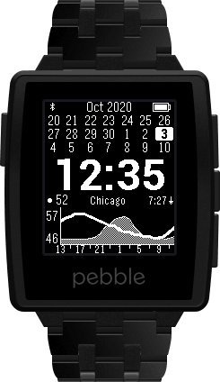

Once upon a time I relied on *ForecasWatch* as the daily driver watchface on my beloved red Pebble Time. Recently, the free tier of the Weather Underground API on which the watchface relied was discontinued, making a huge portion of the watchface unusable.

The developer, RCY, is nowhere to be found in the Rebble era. I plan to continue using my Pebble(s) for years to come, so this is my attempt to revive this wonderful watchface—and this time it's open source!

## Screenshots

    
    

## Features

* Current time
* Battery indicator
* 3 week calendar
* 24 hour weather forecast (updates every 30 minutes)
* Bluetooth connection indicator
* Quiet time indicator
* Night shading
* Multiple weather providers (Weather Underground*, OpenWeatherMap)
* Current temperature
* Temperature forecast (red line)
* Precipitation probability forecast (blue area)
* City where forecast was fetched
* Next sunrise or sunset time
* GPS or manual location entry
* Fahrenheit and Celsius temperatures
* Customize time font and color
* Customize colors for Sundays, Saturdays, and US federal holidays
* Offline configuration page

*\* Using a hacky workaround*

## Platforms

All rectangular watches are supported (Classic, Steel, Time, Time Steel, Pebble 2).

## Installation

### Rebble Store

The [Rebble store](https://apps.rebble.io/en_US/application/5dcdca6ac393f50cf6dbc264) listing is the preferred method to install for automatic updates.

Follow https://help.rebble.io/setup to set up your Pebble app to use the Rebble store.

### Manual install

If you want to sideload a specific build, use the modern Pebble app on [iOS](https://repebble.com/app) or [Android](https://repebble.com/app), which supports installing `.pbw` files directly. Download the latest [`forecaswatch2.pbw`](https://github.com/mattrossman/forecaswatch2/releases/latest/download/forecaswatch2.pbw) release and install it with the app.

## Developers

See [CONTRIBUTING.md](CONTRIBUTING.md) for developer setup and workflow.

## Telemetry

ForecasWatch2 includes privacy-respecting telemetry. I do not collect precise location or API keys. Account and watch identifiers are stored only as server-side HMAC hashes—enough for rough usage stats (e.g. DAU), not as readable IDs.

- Collected: each weather fetch’s outcome and duration, provider, coarse country code when available, app and watch metadata, and an allowlist of non-sensitive settings.
- Not collected: coordinates (lat/lon), city/state, manual location strings, or your API keys.
- Purpose: estimate DAU, see coarse country mix, spot weather-fetch failures, and learn which settings are common.
- You may opt-out of telemetry by disabling it in the settings.
